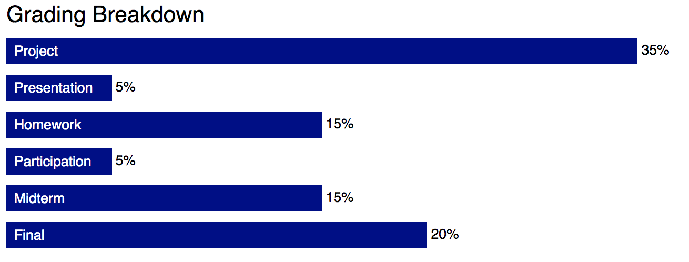
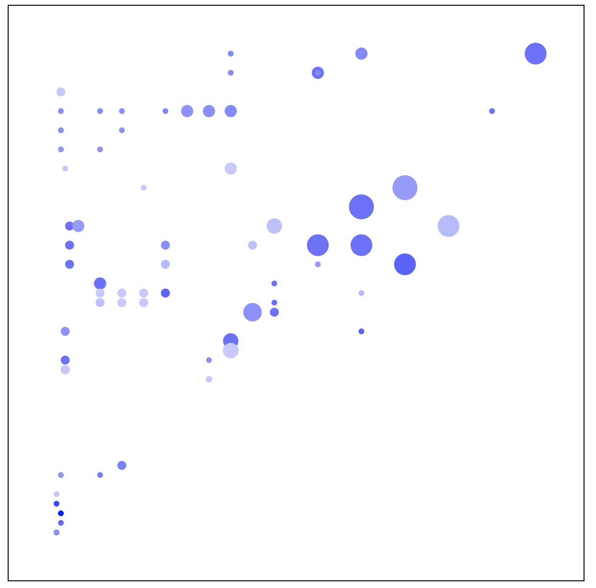

## Homework Assignment 1

Version History: 

- Released, 2019/8/24

**This assignment is due in two parts:**

A: Due Thursday August 29, 8PM

B: Due Thursday September 5, 8PM 

In this assignment we are:

- Demonstrating the assignment workflow for CSC 544
- Assessing our goals in enrolling in this course
- Considering visualizations we have seen "in the wild"
- Practicing using basic web technologies for visualization
- Compiling LaTeX generated from templates
- Practicing a careful reading of a research paper

The artifacts generated should be presented in the HTML pages or LaTeX
documents as described below. No style information should be in the HTML tags
unless explicitly allowed. Do not use HTML tags like `
`, `<b>`, or
`<i>` to alter visual appearance. See Mozilla Developer Network for tag
descriptions to ensure you are not mis-using a tag for presentation against
its set content. Programmatically added SVG elements may have style
attributes.

You will be graded on what is in your github classroom repository associated
with the assignment at the time of the due date. Do NOT include files specific
to your system not required for the assignment (e.g., `.DS_Store` on macos) or
LaTeX compilation files (e.g. `reading.pdf` or `reading.aux`).

### Part A: Survey & Visualization Example. (20 pts) 

Use the following link to create your github repository for this part of the
assignment: 

Use the templates provided with your Github Classroom repository. Turn in the
modified `ha1a.html` and `ha1a.css` files

Replace the name in the title with your name.

Fill out the questionnaire directly in the HTML under the `div` of class
`questionnaire.` 

Under the `div` of class `visualization`, include an image of a visualization
you like and explain what it is and why you chose it (why you like it).
**Note**: I may share these images with the class. Do not include something
you would feel uncomfortable sharing. If you are okay with sharing but do not
want your name attached, please leave a note and I won't associate your name
with the contributed visualization. 

Under the `div` of class `percentages`, create a horizontal bar chart that
shows the distribution of points in this class. Do not use any javascript
libraries. Do not use an SVG or any SVG elements. In this div, you may include
style attributions directly in the HTML tags if you prefer. It should look
like this:

The bar color is dark blue. The fonts are 10 pt sans-serif. 

A sample of the full page is in `HA1/images/544-HA1A-Full.png.`

### Part B: Reading, LaTeX, and SVGs 

Use the following link to create your github repository for this part of the
assignment: 

#### Paper Reading & LaTeX (20 pts)

Read the paper "D3: Data-Driven Documents" and answer the following
questions:

1. What problem is this paper trying to solve?

2. Why is this problem considered a visualization problem?

3. Why is the problem important?

4. How does this paper contribute to solving the problem? 

5. What approaches are used to construct the contributions?

6. How are the contributions of the paper evaluated or justified? 

7. What do you think are this paper's strengths? 

8. What do you think could be improved about this paper?

9. What future directions do the authors suggest? 

10. What future directions not mentioned in the paper would you suggest?

11. What questions do you have about this paper? For example: Were these things
   you find difficult to understand? Are there details left unanswered? Do you
have philosophical questions regarding some of the points made?

12. How might the concepts or approaches in this paper relate to your course
   project? If you have not yet chosen a course project, give your best guess
with what you are thinking of doing now.

Note: These questions have been adapted from similar guides and assignments by
William G. Griswold, Premkumar Devanbu, and Michelle Strout.

The results should be submitted as a LaTeX `.tex` file that will compile into
a `.pdf` with the command `pdflatex`. A template is available in the github
classroom directory as``reading.tex`.

This portion will be graded on whether you have answered all the questions,
including sub-questions, the thoughtfulness of your answers, and the
readability of your answers.

#### Visualization with SVGs (20 pts for bar chart, 40 pts for scatter charts)

For this assignment, do not use any external JS libraries (e.g., d3js or
others). 

Your repository should be pre-loaded with `ha1b.html`, `ha1b.css`, `ha1b.js`,
and `data.js`.  You will modify `ha1b.js` and `ha1b.css` in this assignment.
Do not change the height and width of the SVGs. 

Modify the function `createBarChart` to draw a bar chart in the input SVG
element. Leave a 5 pixel margin within the SVG. The bar chart should come out
similar to the one in HA1A with dark blue bars that are 25 pixels high and
`20 x data` pixels wide. The fonts should be 10 point sans-serif and there
should be 5 pixels of margin to the right of each one.

The dataset is provided in `data.js` as `grade_percents`.

Modify the function `createScatter` to draw scatter plots in the given SVGs.
Leave a 50 pixel margin within the SVG. In other words, the point `(0, 0)` in
the data should appear at the SVG coordinate `(50, 550)` (lower left corner).
The data should span the space within the margins.

The scatter plot mark should be circles of radius between `3` and `13`. The
color of the scatter plot marks should be blue gradients where the red and
green values are equal to each other vary between `0` and `200` and darker
equals a higher value. 

There should be an `svg:title` element associated with each circle. You may
want to look up title elements on the Mozilla Developer Network. The result
should be that on some browsers hovering over the circle will cause the text
to appear. The value of the title should be the item's `Beverage` value
followed by a space and then its `Beverage_prep` value. If the `Beverage` is
`Iced Tea` and the `Beverage_prep` is `Crushed Ice`, the title value should be
`Iced Tea Crushed Ice`.

In the starter code, the `createScatter` function is applied to the last three
SVGs using the `drinks` dataset from `data.js` (taken from the Kaggle beginner
datasets and modified).

Here is an example of a chart (with different options):

These plots will be evaluated for correctness, completeness, and adherence to
specifications.

