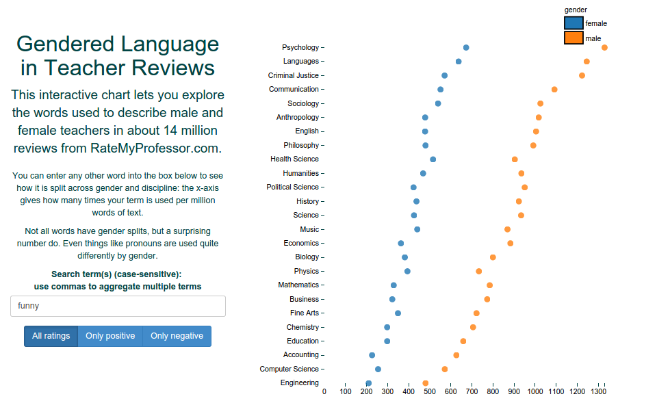
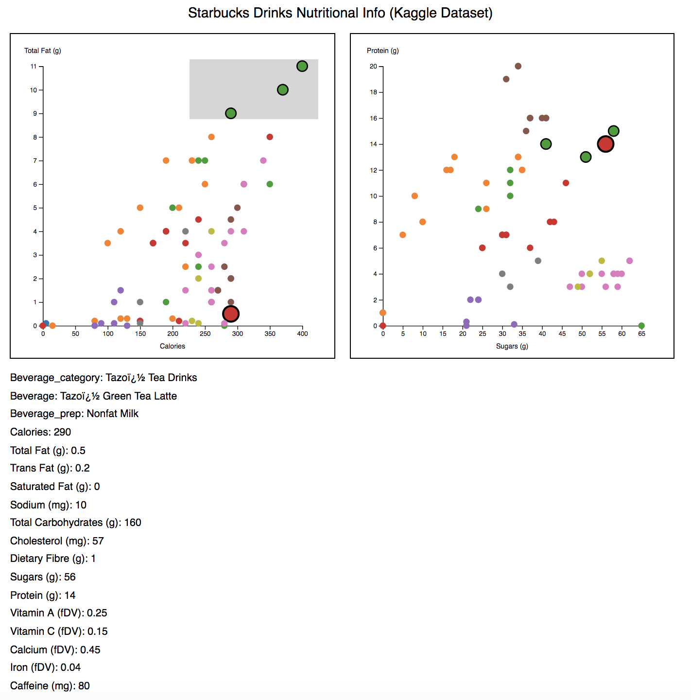

## Homework Assignment 2

Version History: 

- Released, 2019/9/25

Due Thursday Oct 3rd, 11:59PM

In this assignment we are:

- Reviewing material from lecture and practicing short answer questions
- Practicing using the d3js library for visualization
- Practicing using a design pattern/framework to handle UI events
- Gaining familiarity reading and interpreting a user study

The artifacts generated should be presented in the HTML pages or LaTeX
documents as described below. No style information should be in the HTML tags
unless explicitly allowed. Do not use HTML tags like `
`, `<b>`, or
`<i>` to alter visual appearance.  Programmatically added SVG elements may
have style attributes.

Github Classroom Assignment link: 

Anything you want graded should be in the repository at the due date in the
`master` (default) branch. Do not forget to `git commit` and `git push` to
`github.com`. You may want to verify through the web client or cloning to
another place to ensure your commits have been made.

### Short Answer (20 pts)

Answer the following questions:

1. Below is a screen capture of Ben Schmidt's Rate My Professors analysis and
   visualization, taken from
[https://twitter.com/benmschmidt/status/563754577359814656](this tweet).  (a)
Describe a plausible data abstraction of the data here, including what the
data items are, their attributes, and the types for each attribute. (4 pts)
(b) What are the marks, channels, and encoding rules? (4 pts)

2. Explain two approaches to deriving task taxonomies. (2 pts)

3. Suppose you want to know how much training is required to interpret a hive
   plot, so you design an experiment. (a) What are your independent and
dependent variables be and why? (4 pts) 

4. Name and explain three reasons why you may discard a project in the winnow
   phase of a design study? (3 pts)

5. Why is the rainbow colormap considered harmful? (3 pts)

The results should be submitted as a LaTeX `.tex` file that will compile into
a `.pdf` with the command `pdflatex`. You may want to follow the template from
your paper reading. The name of the `.tex` file should be `short.tex`.

This portion will be graded on whether you have answered all the questions,
the thoughtfulness and correctness of your answers, and the readability of
your answers including whether they are still "short answers". If you were
given these questions on an exam, I would give you half a page of space to
write your answers by hand.

If I ask for X of something in a problem, I will grade only the first X
listed if you list more than X.

### Paper Reading (20 pts)

Read the paper "Modeling Color Difference for Visualization Design" by
Danielle Albers Szafir and answer the following questions. These are the same
questions from your previous paper reading assignment.

1. What problem is this paper trying to solve?

2. Why is this problem considered a visualization problem?

3. Why is the problem important?

4. How does this paper contribute to solving the problem? 

5. What approaches are used to construct the contributions?

6. How are the contributions of the paper evaluated or justified? 

7. What do you think are this paper's strengths? 

8. What do you think could be improved about this paper?

9. What future directions do the authors suggest? 

10. What future directions not mentioned in the paper would you suggest?

11. What questions do you have about this paper? For example: Were these things
   you find difficult to understand? Are there details left unanswered? Do you
have philosophical questions regarding some of the points made?

12. How might the concepts or approaches in this paper relate to your course
   project? If you have not yet chosen a course project, give your best guess
with what you are thinking of doing now.

Note: These questions have been adapted from similar guides and assignments by
William G.  Griswold, Premkumar Devanbu, and Michelle Strout.

The results should be submitted as a LaTeX `.tex` file that will compile into
a `.pdf` with the command `pdflatex`. Use the template from the previous
assignment. The name of the `.tex` file should be `reading.tex.`

This portion will be graded on whether you have answered all the questions,
including sub-questions, the thoughtfulness of your answers, and the
readability of your answers.

### Visualization with d3js (60 pts as divided below) 

Implement linked, brushable scatter charts as shown in the movie linked here:
[HA3/videos/HA3-Scatters.mov](HA3/videos/HA3-Scatterplots.mov)

A still shot fo the entire framework is further down.

The directory  is pre-populated with  `ha3.html`, `ha3.css`, `ha3.js`, and
`data.js`. Modify `ha3.html` to put your name in the title. You will modify
`ha3.js` and `ha3.css` in this assignment to implement the below. Do not
change the height and width of the SVGs. 

Use the d3js **version 5** library **and no other**. Do not use calls to
`createElementNS` or `getElementById` etc, even for the detail view.

**Note:** d3js version 5 has different scale functions than d3js version 3.
There are a lot of version 3 examples online. Be sure you're using the
functions here: [https://github.com/d3/d3-scale](https://github.com/d3/d3-scale). 

For any scaling you must do, you should use the d3js scale functions (e.g.,
`d3.scaleLinear()`).

You will create two scatterplots, in the SVGs scatter1 and scatter2 by writing
the createScatter function. These should be drawn similarly to last assignment
with a 50 pixel margin. Note in this assignment, the SVGs are `(500, 500)`
instead of `(600, 600)` like the previous assignment, and therefore the point
`(0, 0)` in the data should appear at the SVG coordinate `(50, 450)`.
Otherwise the scales should appear as before. The data should span this space
as with the previous assignment. For any scaling you must do, you should use
the d3js scale functions (e.g., d3.scaleLinear(). For the categorical colors,
use an ordinal scale with d3.schemeCategory10.

The scales should be labeled with the x-axis label centered in the SVG and the
y-axis label centered over the y-axis. The labels are 8 point sans-serif.

In each scatterplot, the circles for unselected items should have radius `5`.

Add the following interactions:

Selected nodes should be drawn in both plots as circles of radius `8`
with a `2 pixel` black border:

- When the mouse cursor is hovering over a circle, it should be considered
selected.

- Add a rectangular brush. All points in the last brushed area (within the gray
box of the last scatterplot you brushed) should be considered selected. The
brush should persist once the mouse is released.

Clicking on a circle causes all data regarding that item to be printed below
the scatterplots (in the div `details`). Within that div, append a div for
each row of class `rowdetail` and display the property name and value. The
item corresponding to the detail view should be drawn as a circle in both
plots with radius `12` and a `1 pixel` black border. This should persist
post-hover.

Only one circle should show details in this way at a time. Clicking on one
circle should cause the previously clicked circle to revert to normal. If a
circle is both selected and clicked, it should appear as clicked. 

Clicking on a `radius 12` circle should cause the text details to disappear.
(Clicking should act like a toggle.)

The finished visualization should look as below:

As before, MVC should be used and the views should be state-less. Do not store
information in the views. This includes state information such as which data
point is being hovered. The one exception for this assignment is that you may
leave the brush state as-is (kept completely in the view). 

Extra Credit (5 pts): Brushing on a different view than previously brushed
will cause the brush selection in the first view to disappear *without
deleting the brush*. (This is what is shown in the movie.) This action must be
done through MVC.

Differences in Scatterplots From HA2:

- There are labels on the scatterplot axes as shown.
- There is no changing of axes or filtered. Each scatterplot has set axes.
- Hovering over a point does not cause a label to appear.
- Color is used to encode beverage category, not quantitative data
- Size is used to encode selection parameters, not quantitative data

##### Grading

Here is a breakdown of grading by functionality. Partially credit may be
assigned for partial completion.

These points assume that state information and data is managed by the model,
views are stateless, and UI events are managed by the controller. Not adhering
to the separation of concerns will result in partial credit for each feature
where the architecture is violated.

- Basic scatter plot matches encoding given in this assignment: 5 pts
- Scatter plot has axis labels as specified: 5 pts
- Hovering over a point will cause a style change as specified in both views:
  10 pts
- Brushing an area in one plot will cause a style change to selected points as
  specified in both views: 20 pts
  - Brush from one view disappears when brush is used in other view (extra
    credit): 5 pts
- Clicking on a point will:
  - Cause a style change in both views which will toggle: 5 pts
  - Generate the detail view that lists all data for the point: 15 pts
