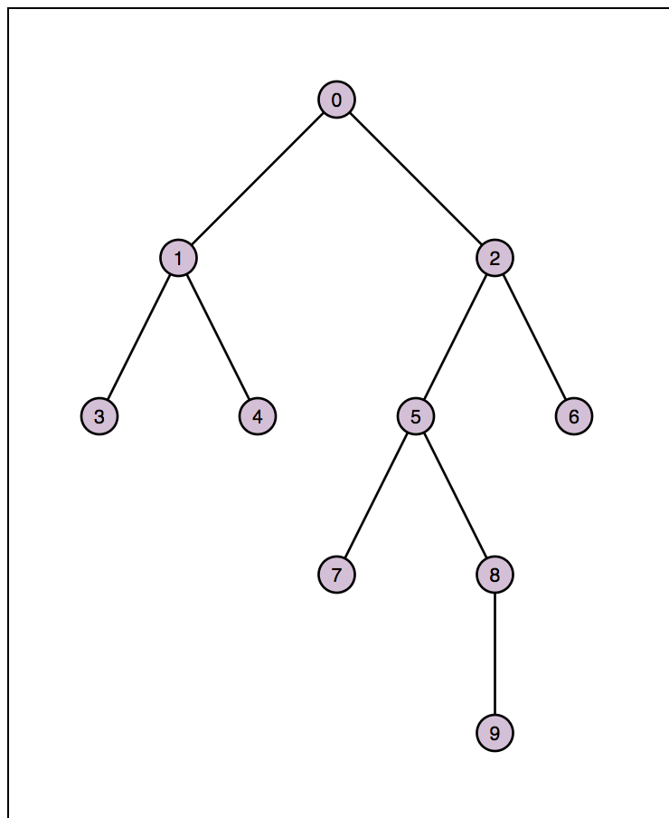

## Homework Assignment 4

Version History: 

- Released, 2019/10/25

Due Thursday Nov 7, 11:59PM

In this assignment we are:

- Demonstrating the Reingold-Tilford Tidy Tree layout for binary trees.
- Practicing using the d3js library for interactive visualization
- Gaining familiarity reading and interpreting a algorithm-driven contribution

The artifacts generated should be presented in the HTML pages or LaTeX
documents as described below. No style information should be in the HTML tags
unless explicitly allowed. Do not use HTML tags like `
`, `<b>`, or
`<i>` to alter visual appearance.  Programmatically added SVG elements may
have style attributes.

Submit your assignment through Github Classroom: 

### Paper Reading (20 pts)

Read the paper "Hierarchical Edge Bundles: Visualization of Adjacency
Relations in Hierarchical Data" by Danny Holten. Then answer the following
questions. **Note the added question in this assignment.**

1. What problem is this paper trying to solve?

2. Why is this problem considered a visualization problem?

3. Why is the problem important?

4. How does this paper contribute to solving the problem? 

5. What approaches are used to construct the contributions?

6. How are the contributions of the paper evaluated or justified? 

7. What do you think are this paper's strengths? 

8. What do you think could be improved about this paper?

9. What future directions do the authors suggest? 

10. What future directions not mentioned in the paper would you suggest?

11. What questions do you have about this paper? For example: Were these things
   you find difficult to understand? Are there details left unanswered? Do you
have philosophical questions regarding some of the points made?

12. How might the concepts or approaches in this paper relate to your course
   project? If you have not yet chosen a course project, give your best guess
with what you are thinking of doing now.

13. Explain what happens to each control point as β is decreased.

Note: These questions have been adapted from similar guides and assignments by
William G.  Griswold, Premkumar Devanbu, and Michelle Strout.

The results should be submitted as a LaTeX `.tex` file that will compile into
a `.pdf` with the command `pdflatex`. Use the template from the previous
assignment. The name of the `.tex` file should be `reading.tex.`

This portion will be graded on whether you have answered all the questions,
including sub-questions, the thoughtfulness of your answers, and the
readability of your answers.

### Visualization with d3js (80 pts)

For this assignment, you will code your own Reingold Tilford Tidy Tree Layout
and corresponding visualization in Javascript with d3js. Use the d3js version
5 library and no other. Do not use the tree layout built into d3js.

You are given `HA4.html`, `HA4.css`, `HA4.js`, and `graphs.js`.  Modify
`HA4.html` so the title contains your name. Do not otherwise modify this file.
Do not modify `HA4.css`. You will modify `HA4.js` for this assignment. Do not
remove existing code from `HA4.js` unless the comments suggest you may.

#### Overview

You will implement an MVC system for drawing binary trees. An array of trees
is provided to you (explained below). 

The model will keep track of the position in the array and the minimum
vertical and horizontal separation between nodes. The minimum separation
between nodes should start at 50 pixels for the first graph and scale to 100
pixels for the last graph.

The view will display the tree as described below. Note the view will call an
external function, calculateGraphLayout, to find the graph layout values.

Clicking on the view will cause the next graph to appear.

The finished visualization should look as below. In the `HA4/movies/` directory, there
is also a movie showing the transition animations.

#### Data

In `graphs.js` there is a single array of JSON objects called `tests`. Each
object in `tests` has a member called `nodes` which is an array of objects
that each contains and `id` as well as the `id` of its `left` and `right`
child (which may be `null`). The value of `id` matches the objects position in
the array. These values describe a binary tree. 

Note the grading dataset will likely contain more graphs.

#### calculateGraphLayout

You will alter these graph objects by adding code to the functions `_RT`,
`_findSubtreeOffset`, `_shiftSubtreeXValues`, and `_initializeContours` in the
function `calculateGraphLayout`. The code should add `x` and `y` values to the
nodes using the Reingold Tilford Tidy Tree Layout as discussed in class.  You
may also refer to the original paper
[http://reingold.co/tidier-drawings.pdf](here). More information about each
of these functions and what they should do can be found in `HA4.js`. 

Note that rather than using the spare left and right pointers to describe the
contours, this assignment creates explicit `left_contour` and `right_contour`
members of each node to hold the IDs of its left and right contours at the 
next depth. 

#### createView

The createView will render the current graph as given by the model. Use the
d3js general update pattern to draw nodes and links. These marks should be
styled using the `node` and `link` classes in `HA4.css`. Additionally, each
node should be labeled with its `node.id` parameter as shown in the movie and
in the style of the `label` class in `HA4.css`.

The edges should never appear on top of the nodes. The labels should always
appear on top  of the nodes.

The entire graph should have a 50 pixel margin from the top and left edges of
the SVG.

Each part of the General Update Pattern should transition over a period of
750ms  and use the following animations:

- Entering nodes should grow from radius 0 to radius 10. 

- Updating nodes should have animated movement between positions

- Exiting nodes should shrink from radius 10 to radius 0.

- Entering links should fade in using `stroke-opacity`.

- Updating links should have animated movement between positions

- Exiting links should fade out using `stroke-opacity`.

- Entering labels should fade in using `opacity`.

- Updating labels should have animated movement between positions

- Exiting labels should fade out using `opacity`.

#### Grading

This is the rough breakdown of points. This breakdown assumes MVC and the
general update patttern are adhered to. Points may not be earned if they
violate these patterns.

- Graph Layout is calculated correctly according to algorithm: 45 pts
  -  Five points will be deducted for each class of cases where the layout is
     incorrect (e.g., different classes of offset miscalculations, failure to
change separation distances between different graphs)
- Graph changes on click: 5 pts
- Nodes:
  - Correct placement: 2pts
  - Correct styles: 2 pts
  - Correct transitions: 3pts 
- Links:
  - Correct placement: 2pts
  - Correct styles: 2 pts
  - Correct transitions: 3pts
- Labels:
  - Correct placement: 2pts
  - Correct styles: 2 pts
  - Correct transitions: 3pts
- Correct Layering across all elements and transitions: 9 pts

If you are unable to get your layout to work, include another file
`hand-drawn-trees.js` with an array called `mytrees` that have the x, y, and
link values filled in already to demonstrate your view and your ability to
calculate the layout coordinates by hand. Include comments with your code
describing the logic behind your implementation of each function. In this case
partial credit may be awarded for what parts of the layout  algorithm with
coded and the correctness of the by-hand values.

